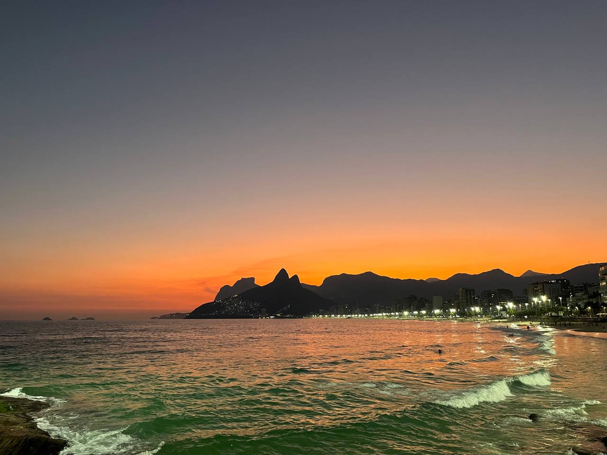
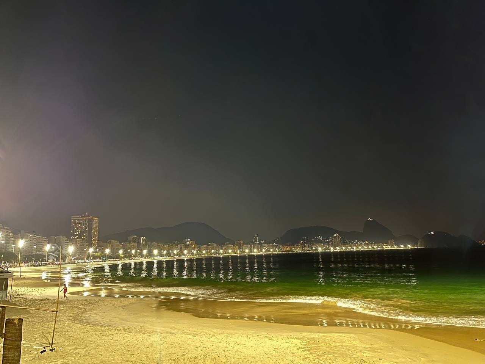
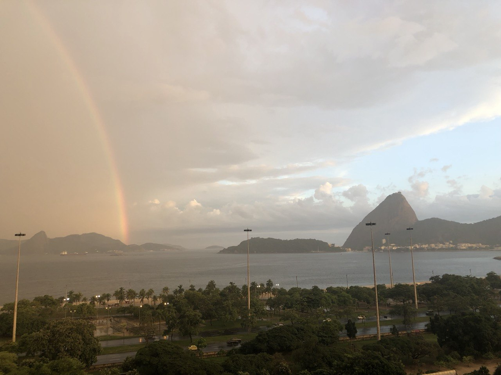
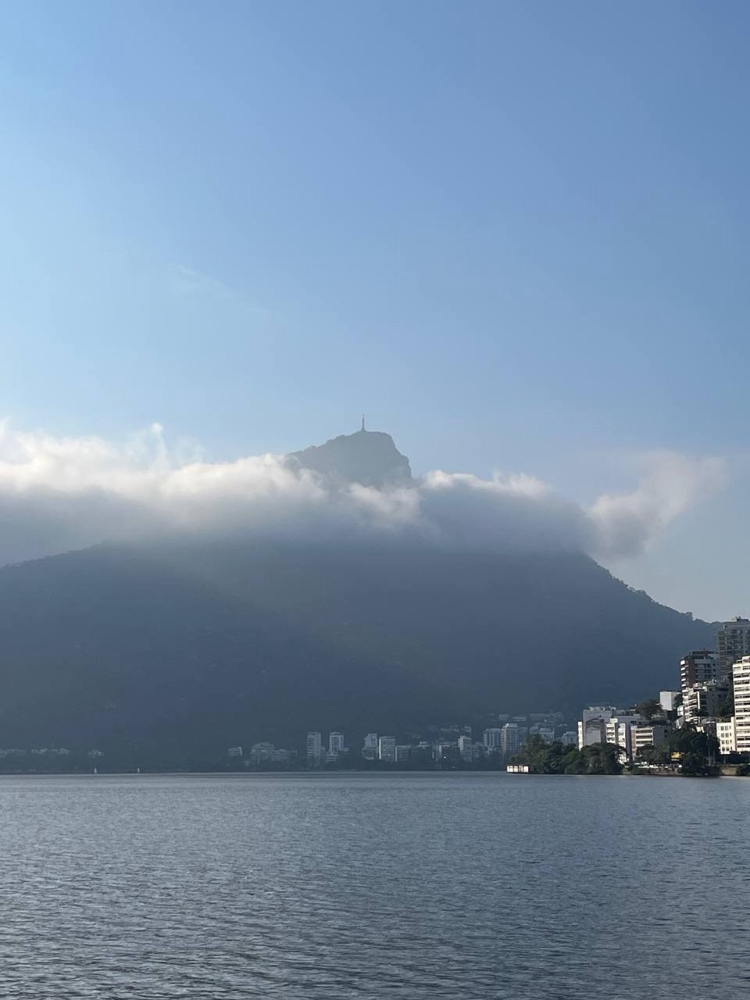
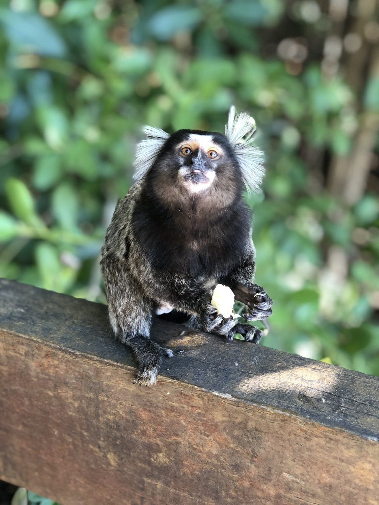
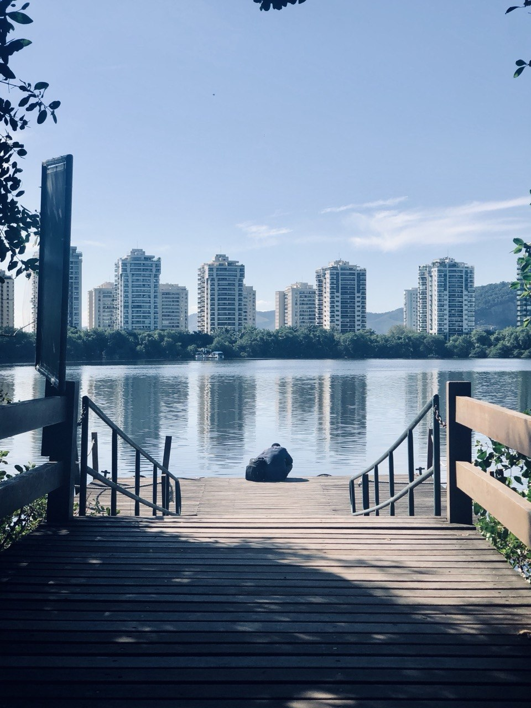
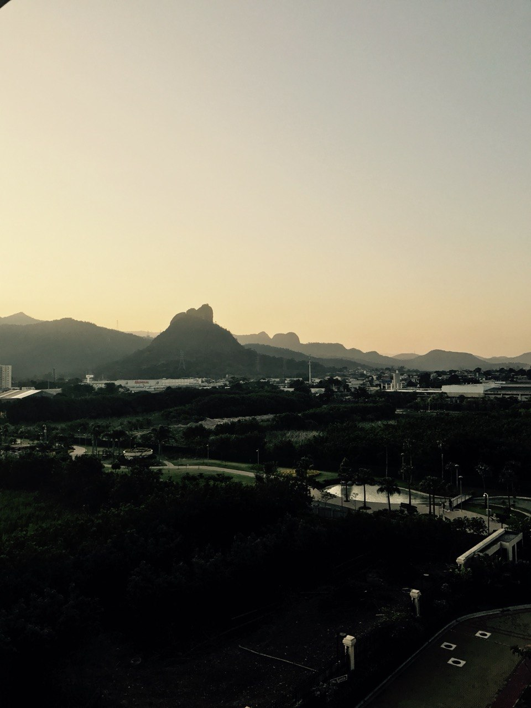

I am from the beautiful city of Rio de Janeiro, Brazil. Rio has undoubtedly been a major influence on my enthusiasm for economics.

I am also a huge fan of history, cooking, and physics. When I am not doing research, I am probably in my kitchen making an experimental dish. My favorite cuisines are Brazilian-Portuguese, Lebanese, and Italian.

## A few of my snapshots from Rio


  <figure class="grid-w50"><figcaption>Ipanema Beach at winter sunset</figcaption></figure>
  <figure class="grid-w50"><figcaption>Copacabana at night, Sugar Loaf in the distance</figcaption></figure>
  <figure class="grid-w50"><figcaption>Rainbow over Botafogo Bay</figcaption></figure>
  <figure class="grid-w50"><figcaption>Christ the Redeemer emerging from clouds atop Corcovado</figcaption></figure>
  <figure class="grid-w50"><figcaption>A marmoset (sagui) perched on a railing</figcaption></figure>
  <figure class="grid-w50"><figcaption>A pier on the Barra lagoon, high-rises across the water</figcaption></figure>
  <figure class="grid-w50"><figcaption>Sunset over the Pedra Branca chain — Pedra da Bruxa rising in the middle</figcaption></figure>

